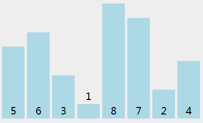
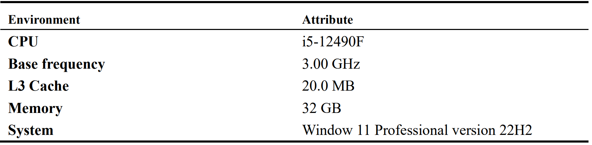
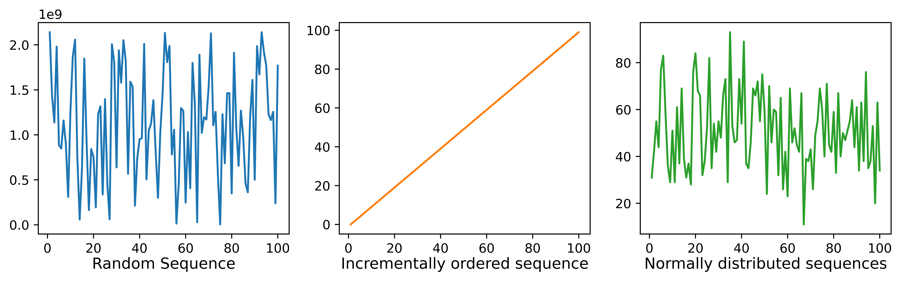
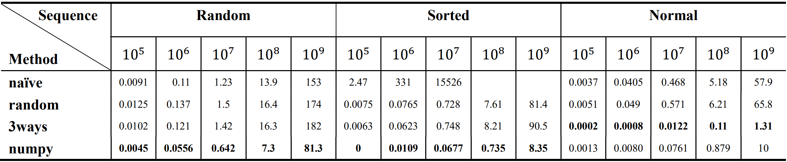
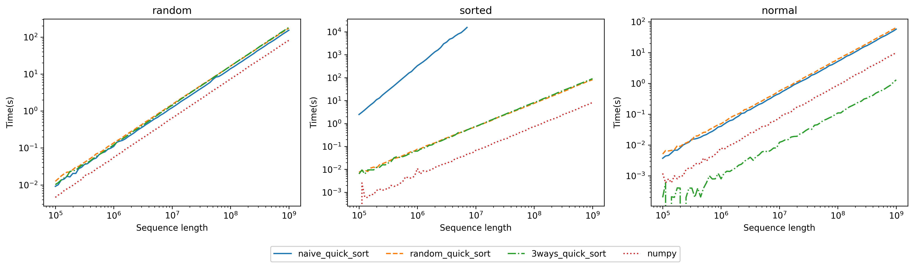
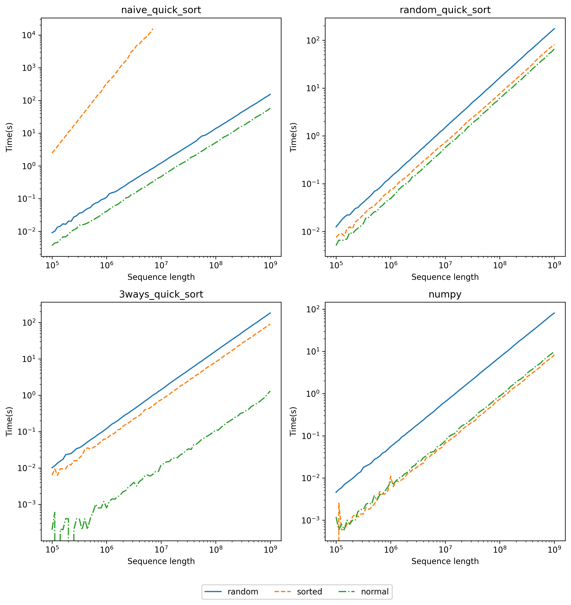

# 快速排序算法及其改进的简单研究


------


## 简介

**快速排序**（Quicksort），又称**分区交换排序**（partition-exchange sort），是一种排序算法，最早由东尼·霍尔提出。在平均状况下，排序n个项目要$O(n\log(n))$次比较。在最坏状况下则需要$O(n^2)$次比较，但这种状况并不常见。事实上，快速排序$\Theta(n\log(n))$通常明显比其他算法更快，因为它的内部循环可以在大部分的架构上很有效率地达成。

**内部循环算法**（In-Place Algorithm）是指一种在算法执行过程中不需要额外的辅助数据结构来存储数据的算法。内部循环算法通常对内存的使用效率要求较高，因为它们需要在原始数据的内存空间中进行操作，而不是创建额外的数据结构来存储中间结果。这有助于减少内存占用并提高算法的性能。

## 方法介绍

### 定义

快速排序使用**分治法**（Divide and conquer）策略来把一个序列分为较小和较大的2个子序列，然后递归地排序两个子序列。

### 基本过程

步骤为：

1. 挑选基准值：从数列中挑出一个元素，称为基准。
2. 分割：重新排序数列，所有比基准值小的元素摆放在基准前面，所有比基准值大的元素摆在基准后面（与基准值相等的数可以到任何一边）。在这个分割结束之后，对基准值的排序就已经完成。
3. 递归排序子序列：递归地将小于基准值元素的子序列和大于基准值元素的子序列排序。递归到最底部的判断条件是数列的大小是零或一，此时该数列显然已经有序。


<center style="font-size:14px;color:#C0C0C0;text-decoration:underline">图1.快速排序</center> 

### 性质
#### 稳定性
快速排序是一种不稳定的排序算法。这里的稳定性是指两个相等的值在排序前后相对位置不变。
#### 时间复制度
快速排序的最优时间复杂度和平均时间复杂度为 $O(n\log n)$，最坏时间复杂度为 $O(n^2)$。

对于最优情况，每一次选择的分界值都是序列的中位数，此时算法时间复杂度满足的递推式为 

$T(n) = 2T(\dfrac{n}{2}) + \Theta(n)$，由主定理，$T(n) = \Theta(n\log n)$。

对于最坏情况，每一次选择的分界值都是序列的最值，此时算法时间复杂度满足的递推式为 $T(n) = T(n - 1) + \Theta(n)$，累加可得 $T(n) = \Theta(n^2)$。

对于平均情况，每一次选择的分界值可以看作是等概率随机的
### 代码实现
#### 朴素快速排序

**朴素快速排序**算法选取一个**固定元素**作为基准值，一般选取首元素、尾元素或中间元素，为了方便测试最坏情况，这里选择实现以首元素为基准值的朴素快速排序，

```c++
#include <iostream>
const int maxn = 1e8;
int st[maxn], t = 0;
extern "C" {
std::pair<int, int> partition(int q[], int l, int r)
{
    int i = l - 1, j = r + 1, x = q[l];
    while (i < j) {
        do
            i++;
        while (q[i] < x);
        do
            j--;
        while (q[j] > x);
        if (i < j) {
            std::swap(q[i], q[j]);
        }
    }
    return std::make_pair(j, j + 1);
}

void sort(int q[], int l, int r)
{
    if (l < r) {
        std::pair<int, int> pa = partition(q, l, r);
        int j = pa.first, k = pa.second;
        if (j > l) {
            st[t++] = l;
            st[t++] = j;
        }
        if (k < r) {
            st[t++] = k;
            st[t++] = r;
        }
        while (t != 0) {
            int sr = st[--t];
            int sl = st[--t];
            pa = partition(q, sl, sr);
            j = pa.first, k = pa.second;
            if (j > sl) {
                st[t++] = sl;
                st[t++] = j;
            }
            if (k < sr) {
                st[t++] = k;
                st[t++] = sr;
            }
        }
    }
}
}
```

所以，我们需要对朴素快速排序思想加以优化。较为常见的优化思路有以下三种：

1. 通过 **三数取中（即选取第一个、最后一个以及中间的元素中的中位数）** 的方法来选择两个子序列的分界元素（即比较基准）。这样可以避免极端数据（如升序序列或降序序列）带来的退化
2. 每趟排序后，**将与分界元素相等的元素聚集在分界元素周围**，这样可以避免极端数据（如序列中大部分元素都相等）带来的退化。
3. 当序列较短时，使用 **插入排序** 的效率更高。

#### 随机快速排序

**随机快速排序**是对朴素快速排序的改进，不再选取序列中的固定位置值作为基准，而**随机选取**待排序列中任意一个数作为基准值，这是对朴素快速排序算法的第一个优化的延申，通过选取随机值，可以避免在有序序列中的退化。

```c++
unsigned int generateSeedFromTimestamp()
{
    auto now = std::chrono::system_clock::now();
    auto timestamp = std::chrono::duration_cast<std::chrono::milliseconds>(
        now.time_since_epoch());

    return static_cast<unsigned int>(timestamp.count());
}
unsigned int seed = generateSeedFromTimestamp();
std::mt19937 engine(seed);
std::pair<int, int> partition(int q[], int l, int r)
{
    int i = l - 1, j = r + 1, x = q[l + engine() % (r - l + 1)];
    while (i < j) {
        do
            i++;
        while (q[i] < x);
        do
            j--;
        while (q[j] > x);
        if (i < j) {
            std::swap(q[i], q[j]);
        }
    }
    return std::make_pair(j, j + 1);
}
```

然而对于**随机快速排序**，其并未解决当序列中大部分元素都相等带来的退化，对此下一个算法将对此进行优化。

#### 三路快速排序

在介绍**三路快速排序**之前，先介绍一下**二路快速排序**，之前的算法实现将数据分成的两部分，默认把等于基准值的分在了其中的一边，如果要排序的数组中和基准值相等的很多，那就会出现左右不均，这样快排的速度也会退化。**二路排快速序**算法的思想则是将等于基准值的数平均分配给两边。

**三路快速排序**（3-way Radix Quicksort）是快速排序和基数排序的混合。它的算法思想基于荷兰国旗问题的解法。荷兰国旗问题是Edsger Dijkstra提出的一个计算问题。 荷兰国旗由三种颜色组成：红色、白色和蓝色。给定这三种颜色的球随机排列成一条线，任务是排列它们，使所有相同颜色的球都在一起，并且它们的集体颜色组按正确的顺序排列。

**三路快速排序**在随机选取基准值 m 后，将待排数列划分为三个部分：小于 m、等于 m 以及大于 m。这样做即实现了将与分界元素相等的元素聚集在分界元素周围这一效果。三路快速排序在处理含有多个重复值的数组时，效率远高于原始快速排序，其最佳时间复杂度为$O(n)$


```c++
std::pair<int, int> partition(int q[], int l, int r)
{
    int i = l, j = l, k = r, x = q[l + engine() % (r - l + 1)];
    while (i <= k) {
        if (q[i] < x)
            swap(q[i++], q[j++]);
        else if (q[i] > x)
            swap(q[i], q[k--]);
        else
            ++i;
    }
    return std::make_pair(j - 1, k + 1);
}
```

在三路快速排序的基础上，我还实现了**插入排序**，完成第三个优化，进一步优化排序算法在较短有序子序列上的排序。

```c++
void insertSort(int q[], int l, int r)
{
    for (int i = l + 1; i <= r; i++) {
        int j = i;
        while (j > l) {
            if (q[j] < q[j - 1]) {
                swap(q[j], q[j - 1]);
                j--;
            } else {
                break;
            }
        }
    }
}
```

## 实验

### 实验概要
本实验采用python与C++共同实现，一方面使用C++编写排序算法，然后将其编译成动态库，另一方面使用python调用C的库实现排序并记录，原因如下：

1.  C++ 是一种编译型语言，通常比 Python 更快，适用于需要高性能的应用程序。
2.  Python 是一种解释型语言，易于学习和阅读，拥有大量的标准库和第三方库，用于数据科学更为方便。
实验通过记录不同类型数据集的不同长度下排序所花费的时间对**算法的性能**进行评价，再比较同一算法在不同数据集的表现来对**算法的稳定性**进行评价。


### 实验设置

由于**计算机问题和数学问题往往并不完全等价**，且排序算法是一个IO密集型问题，而IO密集型问题通常与cache命中率息息相关，为了使实验结果与理论计算结果尽可能接近，需要最大限度保证各组实验变量的一致性，所以这里选择排序序列的长度是一个很重要的因素。因为每个int类型占4 B，而L3缓存容量为20 MB，20 MB/4 B  =  5,242,880<$10^7$，所以为了全面评判算法的性能，这里选取序列长度范围为[$10^5$,$10^9$]，这样可以保证实验数据覆盖了完全利用cache性能的部分和无法完全利用cache性能的两种情况。因为cache空间不一定能被程序独占，对于小于$10^7$序列排序时间的反复震荡是正常现象，所以分析时只考虑大致趋势即可，而对于大于$10^7$序列排序时间的变化则需要重点关注。

由于序列长度从$10^5$到$10^9$有一个很剧烈的变化，为了更全面的揭示序列长度变化与排序时间的关系，**采用将对这一范围进行等比采样，共采用41个点，每个序列长度跑10次取平均成绩**。但有一组实验是例外，对于在有序序列上排序的朴素快速排序算法，由于其时间复杂度退化成$O(n^2)$，所花费的时间随序列长度增长过于巨大，本实验仅对其实验序列长度增长到$10^7$即停止实验，且每个序列长度仅跑一次当最终成绩。

本实验所使用的环境如下:



<center style="font-size:14px;color:#C0C0C0;text-decoration:underline">表1.实验环境</center> 

#### 数据集

实验使用3个不同类型的数据集，从有序无序上可以分为两类，有序的**单调递增序列**和**无序的随机分布序列**与**正态分布序列**；从分布情况可以分为，每个数仅出现一次的**单调递增序列**和数据可能出现多次的**随机分布序列**和**正态分布序列**。

+ 随机分布无序序列，由`numpy.random.randint`生成的序列，范围为$[0,2^{31}-1]$。在序列长度较短时，其数值是稀疏的(几乎不存在相等的两个值)，而随着长度增长，其数值会越来越稠密(相等的值会越来越多)。

+ 递增有序序列，由`data = np.arange`生成的序列，范围为$[0,length]$。该数列是为了测试朴素快速排序算法最坏情况特别设计的，保持了有序这一特点。
+ 正态分布无序序列，平均值设置为$\frac{length}{2}$，标准差设置为$\frac{length}{6}$，且限制值在$[0,length]$中。该序列在任何长度的情况下均有相似的稀疏性，可以较好的测试算法不同的序列长度在下但存在部分相等值的执行性能。



<center style="font-size:14px;color:#C0C0C0;text-decoration:underline">图2.数据集分布</center> 

#### 基准

使用前文所提及的快排及其改进实现充当Baseline的同时，增加目前可以认为是SOTA的**numpy**的排序算法的对比。

+ **朴素快排**，将朴素快排的c++代码编译成动态库进行调用。
+ **随机快排**，将随机快排的c++代码编译成动态库进行调用。
+ **三路快排**+**插入排序**，将三路快排的c++代码编译成动态库进行调用。
+ **numpy库排序**，直接调用`numpy`库中的 `numpy.sort()`，本实验的SOTA算法。

### 实验比较与分析




<center style="font-size:14px;color:#C0C0C0;text-decoration:underline">表2.实验结果，粗体表示最好结果</center> 


#### 性能比较


<center style="font-size:14px;color:#C0C0C0;text-decoration:underline">图3.快速排序性能比较</center> 

从**随机分布无序序列**的结果来看，**朴素快排**性能小优于**随机快排**和**三路快排**，而**numpy排序**则遥遥领先。原因是显然的，**随机快排**和三路快排都需要额外的资源来获取随机数和进行额外的取模操作。

随机分布无序序列不同长度其实有不同的稀疏性，一开始长度较小时，序列中的值是稀疏的，但随着序列长度增加，会越来越有可能出现之前出现过的值，从而使得序列的值开始密集，这也有利于三路快排，但实际表现中，三路快排却略逊于随机快排，这个结果可能的解释是，稀疏性的变化带来的益处仍未超过三路快排中多次交换的消耗。

从**递增有序序列**的结果来看，**numpy排序**有着巨幅的领先，**朴素快排**的表现十分难看，当然这是因为精心设计的数据导致的其性能退化到$O(n^2)$，而**numpy排序**是先把数据用快排排序一遍，然后再用timsort排一遍。正好击中了内置排序算法timsort的甜点。timsort的特点之一是，对原本有序程度很高的数据，时间复杂度接近$O（n）$。而采用随机选取基准值的**随机快排**和**三路快排**很好的避免了最坏的情况。与随机分布无序序列类似，**随机快排**略优于**三路快排**，因为其其有更少的交换次数。

从**正态分布无序序列**的结果来看，最令人出乎意料的是**三路快排**获得最好的结果，这是因为此时数组内存在大量的重复的相等值，且中间值有更大的可能被选取为基准值，这进一步提高了三路快排的排序速度，而此时**朴素快排**略优于**随机快排**。


#### 稳定性比较


<center style="font-size:14px;color:#C0C0C0;text-decoration:underline">图4.快速排序稳定性比较</center> 

从**朴素快排**在3个不同类型序列的表现来看，其在**有序序列**中的表现非常糟糕，且其在**正态分布无序序列**中的性能优于**随机分布无序序列**的性能，原因在于其每次选取基准值都有更大的可能选取到中间值，故更接近理论理论最优情况而获得更好的性能表现。**总体而言，朴素快排的稳定性很差**。

从**随机快排**在3个不同类型序列的表现来看，其在**有序序列**中的表现居然优于**随机分布无序序列**，可能的原因是序列相对有序，由于选取的基准值随机选择，在避免了朴素快排的最差情况的同时，减少了每次划分时的交换次数，从而减少了排序的时间。**总体而言，随机快排的稳定性最好，其在3类数据中表现差距最小。**

从**三路快排**在3个不同类型序列的表现来看，其对序列中相同数值的个数十分敏感，因此在有大量相同数值的**正态分布无序序列**中，其不但有更大概率选取数量更多中间值获得更好的划分，还进一步减少了下一轮排序的序列，从而获得最好的性能。对于**有序序列**和**随机分布无序序列**的性能差距与随机快排类似。**总体而言，三路快速排序的稳定性一般。**

**numpy排序**也是基于快排实现的，但是其对不同情况都进行了优化，所以取得了大部分情况下的最好性能，但其对于正态分布序列的排序性能不如三路快排。**总体而言。numpy排序在性能出色的同时稳定性也很出色。**

## 结论

总的来说，随机化算法是一种有用的工具，可以用于解决各种类型的问题，但它们需要谨慎使用，并根据具体问题的性质和要求来选择。在某些情况下，随机化算法可以提供高效的解决方案，但在其他情况下，可能需要更传统的确定性算法。

## 参考文献

- [1] [Wikipedia](https://zh.wikipedia.org/wiki/%E5%BF%AB%E9%80%9F%E6%8E%92%E5%BA%8F)
- [2] [OI Wiki ](https://zh.wikipedia.org/wiki/%E5%BF%AB%E9%80%9F%E6%8E%92%E5%BA%8F)
- [3] [常用算法模板 ](https://www.acwing.com/blog/content/277/)
- [4] [GPT ](https://chat.openai.com/)
- [5] [ctypes ](https://docs.python.org/3/library/ctypes.html)
- [6] [【数据结构与算法】快速排序、随机基准值、双路快排、三路快排 ](https://blog.csdn.net/Hanoi_ahoj/article/details/105495178)
- [7] [【算法图文动画详解系列】QuickSort 快速排序算法 ](https://www.jianshu.com/p/a04f0b59b221)
- [8] [IntroSort-内省排序 ](https://www.luogu.com.cn/blog/d0j1a1701/introsort)
- [9] [为什么 python 内置的 sort 比自己写的快速排序快 100 倍？ ](https://www.zhihu.com/question/503261465/answer/2546649397?utm_id=0)